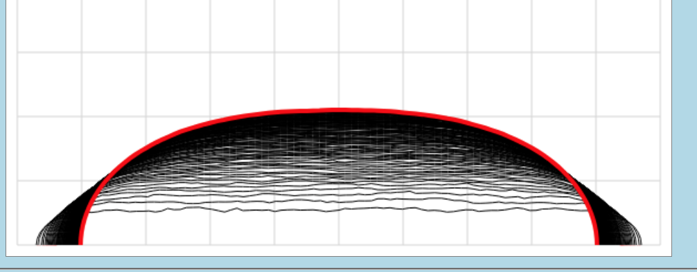

# HotApplePi_Segments
Segment approximation for optimum Hot Apple Pi Box

## Run it now
[Live program](https://alfille.github.io/HotApplePi_Segments/)
-- no downloads, no cookies, no ads

## Background
See [Hot Apple Pi](https://github.com/alfille/HotApplePi)

## What is this?
This is the Javascript App for calculating Hot Apple Pie boxes with maximum volume.

You can choose:

* Algorithm (a custom gradient or a slow Genetic)
* Length of box (relative to width)
* Number of segments (100 is a good choice)
* Iterations

## Details

[Theory and results](https://alfille.github.io/HotApplePi/segments.html)

By Paul H Alfille 2024
MIT License
Pure Javascript with Web Workers
